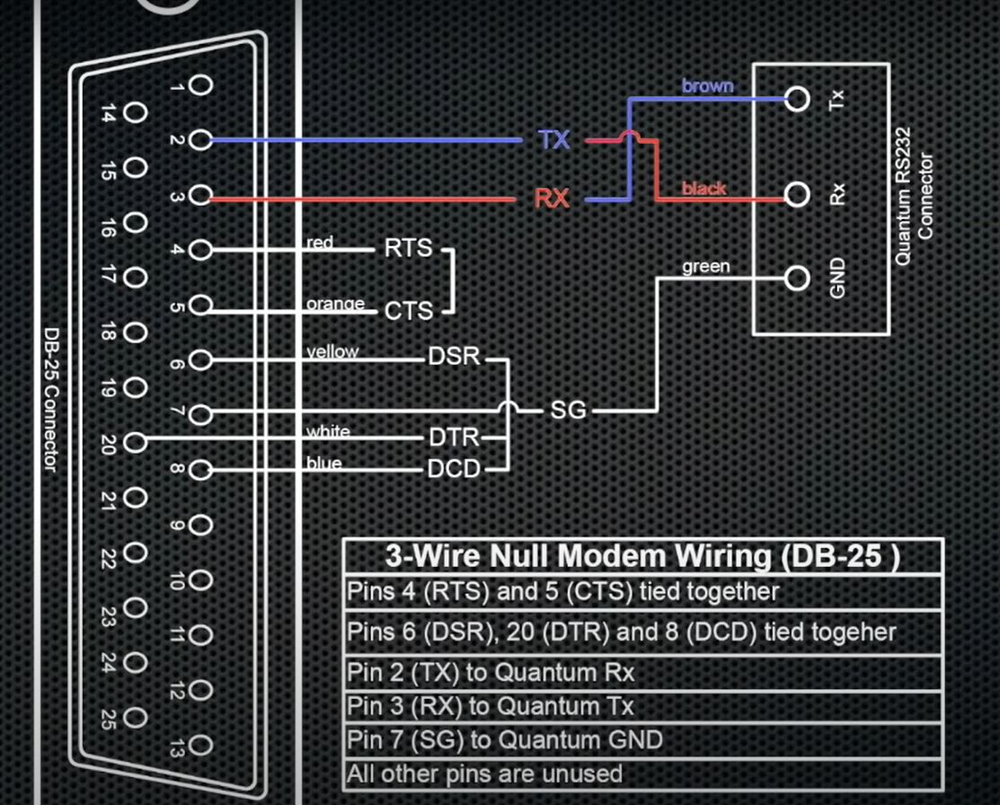

**RS232:**

**Type:**
* DB-9 and DB-25 - Male / Female

**Pinout Details:**
* **DTE** - Data Terminal Equipment.
* **DCE** - Data Communication Terminal Equipment.

  

* **DTR** - Data Terminal Ready - Defines the *Sender* is ready.
* **DSR** - Data Set Ready - Voltage is set when *Receiver* is ready.

* **RTS** & **CTS** - This helps to define that both the sender and receiver are available for communication. This is a *Hardware Flow Control* implementation.

Note:
* *XON and XOFF* - *Software Flow control* to start the communication.
